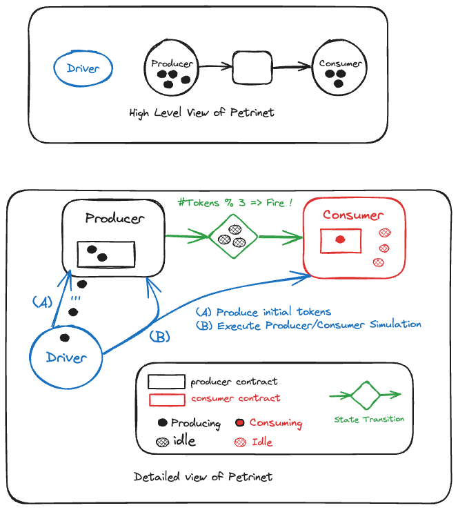

# Petri Nets Producer Consumer

**Summary**

Here is a simple Petri Net implemented as a Motoko actor. The Petri Net consists of nodes, tokens, states, and transitions. Petri Nets can be used for various design patterns, this pattern is a producer-consumer model. Motoko uses asynchronous functions to model the behavior of a producer and a consumer, interacting with a shared state thru transition code. 




**Walkthrough**

1. **Petri Net Setup**
   - The Petri Net actor includes utility functions using random numbers to simulate work.  It defines types for `State`, `Token`, `Transition`, and `Node`.

1. **Producer and Consumer Transitions**
   - Two transition functions are defined: `producerContract` and `consumerContract`. These functions manipulate a `Token` by updating its `count` and `state` based on certain conditions.

1. **Random Number Generation**
   - The `doThingsAndUpdate` function simulates the consumption process based on a randomly generated number. If the random number is divisible evenly by the token count, the state becomes `Idle`; otherwise, it becomes `Consuming`.

1. **Transition Execution**
   - The `fireTransition` function takes a `Node` and executes its associated transition, updating the node's token accordingly.

1. **Node Initialization:**
   - Two nodes, `producerNode` and `consumerNode`, are initialized with initial tokens and associated transition functions.

1. **Producer and Consumer Functions**
   - The `producer` and `consumer` functions trigger transitions for the producer and consumer nodes, respectively. The shared state is updated between them.

1. **Driver Function:**
   - The `driver` function orchestrates the interaction between the producer and consumer nodes in a loop. It iterates `n` times, calling the producer function and then alternating with the consumer function until the consumer's token count is zero.

**Deploy and Run**
```bash
> # Deploy: start dfx and deploy canisters 
> dfx start --background
> dfx deploy 
```
```bash
> # Run: command line 
> # call producer a few times 
> dfx canister call <backend-canister> producer
> dfx canister call <backend-canister> producer
> # call consumer which will run til idle state. 
> dfx canister call <backend-canister> consumer
> # call driver initialising token count of 12
> dfx canister call <backend-canister> driver '(12)'
>
> Run: on localhost frontend
> npm start 
> # goto https://localhost:8080 and run driver 
```


**TODO**
- The code does not handle errors or exceptions explicitly.
- Refactor Petri Net transitions to support multiple arcs.

This code provides a basic implementation of a Petri Net in Motoko, demonstrating the interaction between a producer and a consumer within the context of state transitions.


# dfx project documentation
Welcome to your new petrinet_producer_consumer project and to the internet computer development community. By default, creating a new project adds this README and some template files to your project directory. You can edit these template files to customize your project and to include your own code to speed up the development cycle.

To get started, you might want to explore the project directory structure and the default configuration file. Working with this project in your development environment will not affect any production deployment or identity tokens.

To learn more before you start working with petrinet_producer_consumer, see the following documentation available online:

- [Quick Start](https://internetcomputer.org/docs/current/developer-docs/setup/deploy-locally)
- [SDK Developer Tools](https://internetcomputer.org/docs/current/developer-docs/setup/install)
- [Motoko Programming Language Guide](https://internetcomputer.org/docs/current/motoko/main/motoko)
- [Motoko Language Quick Reference](https://internetcomputer.org/docs/current/motoko/main/language-manual)

If you want to start working on your project right away, you might want to try the following commands:

```bash
cd petrinet_producer_consumer/
dfx help
dfx canister --help
```

## Running the project locally

If you want to test your project locally, you can use the following commands:

```bash
# Starts the replica, running in the background
dfx start --background

# Deploys your canisters to the replica and generates your candid interface
dfx deploy
```

Once the job completes, your application will be available at `http://localhost:4943?canisterId={asset_canister_id}`.

If you have made changes to your backend canister, you can generate a new candid interface with

```bash
npm run generate
```

at any time. This is recommended before starting the frontend development server, and will be run automatically any time you run `dfx deploy`.

If you are making frontend changes, you can start a development server with

```bash
npm start
```

Which will start a server at `http://localhost:8080`, proxying API requests to the replica at port 4943.

### Note on frontend environment variables

If you are hosting frontend code somewhere without using DFX, you may need to make one of the following adjustments to ensure your project does not fetch the root key in production:

- set`DFX_NETWORK` to `ic` if you are using Webpack
- use your own preferred method to replace `process.env.DFX_NETWORK` in the autogenerated declarations
  - Setting `canisters -> {asset_canister_id} -> declarations -> env_override to a string` in `dfx.json` will replace `process.env.DFX_NETWORK` with the string in the autogenerated declarations
- Write your own `createActor` constructor
